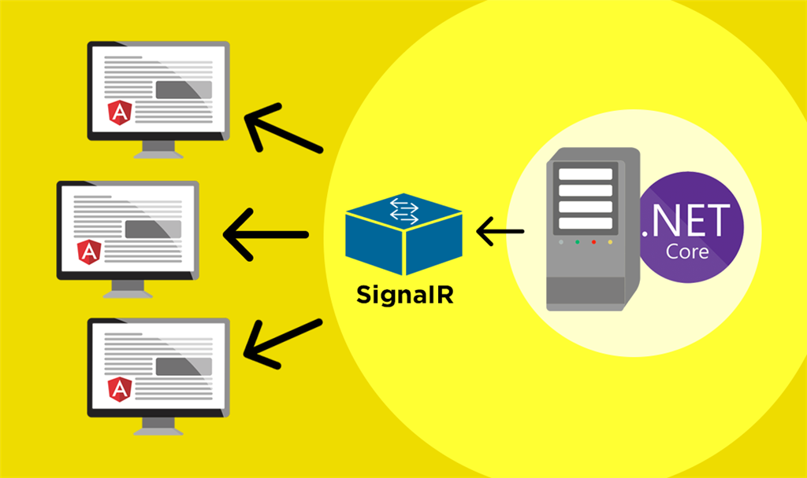
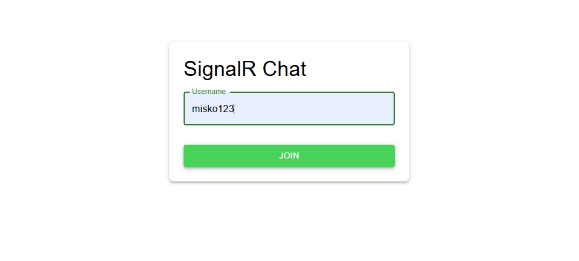
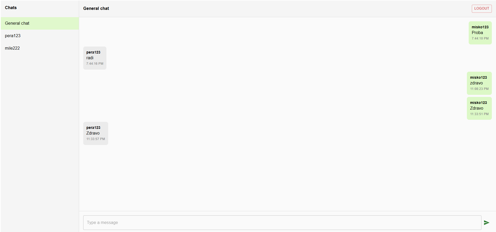
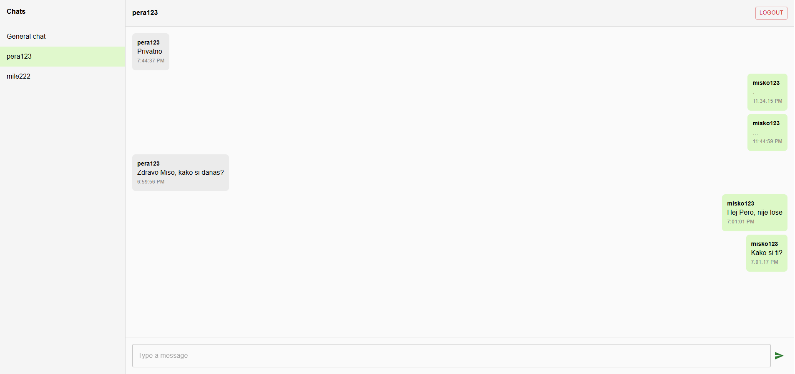

# SignalR Chat Application

### Real-time komunikacija u ASP.NET Core + React aplikaciji

---

## Sadržaj

- [Opis projekta](#opis-projekta)
- [Problem koji se rešava](#problem-koji-se-rešava)
- [Rešenje – SignalR](#rešenje--signalr)
- [Alternativna rešenja](#alternativna-rešenja)
- [Arhitektura sistema](#arhitektura-sistema)
- [Funkcionalnosti aplikacije](#funkcionalnosti-aplikacije)
- [Pokretanje projekta](#pokretanje-projekta)
- [Izgled aplikacije](#izgled-aplikacije)
- [Primeri koda](#primeri-koda)
- [Zaključak](#zaključak)

## Opis projekta

Ovaj repozitorijum predstavlja **edukativni tutorijal** koji demonstrira upotrebu **SignalR tehnologije** za realizaciju real-time komunikacije u web aplikacijama.

Kroz jednostavnu chat aplikaciju prikazani su osnovni koncepti:

* dvosmerne komunikacije između klijenta i servera
* grupisanja korisnika (chat rooms)
* slanja poruka u realnom vremenu
* integracije SignalR-a sa React frontend-om

---

## Problem koji se rešava

Klasične web aplikacije koriste HTTP request–response model, koji nije pogodan za:

* chat aplikacije
* notifikacije u realnom vremenu
* kolaborativne sisteme

U tim slučajevima klijent mora stalno da proverava server da li ima novih podataka, što:

* povećava opterećenje servera
* uvodi kašnjenja
* komplikuje implementaciju

---

## Rešenje – SignalR

**SignalR** je biblioteka iz .NET ekosistema koja omogućava:

* stalnu konekciju između klijenta i servera
* trenutno slanje poruka
* automatski izbor najboljeg transporta (WebSockets, SSE, Long Polling)

U ovom projektu SignalR se koristi za:

* real-time razmenu poruka
* javni (general) chat
* privatne chat-ove između korisnika

---

## Alternativna rešenja

* WebSockets (ručna implementacija)
* Socket.IO (Node.js)
* Firebase Realtime Database

SignalR je izabran jer:

* je prirodan izbor u ASP.NET Core aplikacijama
* zahteva manje koda
* ima odličnu podršku za grupe (chat rooms)
* pogodan je za edukativne projekte

---

## Arhitektura sistema

### Backend

* ASP.NET Core Web API
* SignalR
* Entity Framework Core
* SQLite baza

### Frontend

* React
* TypeScript
* Vite
* Material UI
* @microsoft/signalr client

```
React UI
   ↓
SignalR JS Client
   ↓
SignalR Hub (ASP.NET Core)
   ↓
Entity Framework Core
   ↓
SQLite Database
```


---

## Funkcionalnosti aplikacije

* login sa korisničkim imenom (bez autentikacije)
* general chat soba
* privatni chat između dva korisnika
* real-time razmena poruka
* čuvanje poruka u bazi
* učitavanje istorije poruka pri ulasku u chat
* logout funkcionalnost

> Chat sobe nisu poseban entitet u bazi – identifikuju se string-om (`general`, `private-user1-user2`).

---

## Backend – SignalR Hub

Centralna komponenta sistema je **SignalR Hub**, koji:

* prima konekcije klijenata
* dodaje korisnike u grupe
* prosleđuje poruke svim korisnicima u istoj sobi
* čuva poruke u bazi

### Glavne operacije:

* `JoinRoom`
* `LeaveRoom`
* `SendMessage`

---

## Baza podataka

Korišćena je **SQLite** baza sa Entity Framework Core.

Čuva se:

* korisnik
* poruke (sadržaj, vreme, soba)

Baza se koristi isključivo za:

* prikaz istorije poruka

---

## Frontend – React aplikacija

Frontend je implementiran pomoću React + TypeScript, uz **Material UI** za izgled.

Layout je inspirisan popularnim chat aplikacijama (WhatsApp, Messenger).

### Glavne komponente:

* Login
* Sidebar (lista chat-ova)
* ChatRoom
* MessageList
* MessageInput

SignalR logika je izdvojena u poseban servis (`signalRService.ts`).

---

## Pokretanje projekta

### Preduslovi

Instalirano:

* **.NET SDK 9.0**
* **Node.js 18+**
* **npm**

---

### Backend

1. Pozicionirati se u backend folder

```bash
cd API
```

2. Instalirati pakete (ako je potrebno):

```bash
dotnet restore
```

3. Pokrenuti aplikaciju:

```bash
dotnet run
```

Backend će raditi na:

```
https://localhost:5000
```

---

### Frontend

1. Ući u `client` folder:

```bash
cd client
```

2. Instalirati zavisnosti:

```bash
npm install
```

3. Pokrenuti aplikaciju:

```bash
npm run dev
```

Frontend će biti dostupan u browser-u na:
```
http://localhost:3000
```

---

## Izgled aplikacije

### Prijava

### General chat

### Privatni chat


---

## Primeri koda

### Konfiguracija baze

* appsettings.json
```
{
  "ConnectionStrings": {
    "DefaultConnection": "Data Source=signalrchat.db"
  }
}
```
* Program.cs
```
builder.Services.AddDbContext<ChatDbContext>(opt =>
    {
        opt.UseSqlite(builder.Configuration.GetConnectionString("DefaultConnection"));
    });
```

### Konfiguracija SignalR-a
```
builder.Services.AddSignalR();
app.MapHub<ChatHub>("/chatHub");
```

SignalR se registruje u ASP.NET Core aplikaciji pozivom `AddSignalR()`, čime se omogućava real-time komunikacija između servera i klijenata.  
Metodom `MapHub<ChatHub>("/chatHub")` definiše se URL endpoint preko kojeg se frontend aplikacija povezuje sa SignalR Hub-om.

### SignalR Hub – Backend logika

SignalR Hub predstavlja centralnu tačku komunikacije između klijenata i servera. Svaki povezani klijent komunicira sa serverom kroz Hub metode.

* Join u chat sobu:

```
public async Task JoinRoom(string roomId, string username)
{
    await Groups.AddToGroupAsync(Context.ConnectionId, roomId);
}
```
Metoda `JoinRoom` omogućava klijentu da se pridruži određenoj chat sobi.  
SignalR koristi koncept **grupa**, gde svaka grupa predstavlja jednu chat sobu.  
Svaka konekcija se identifikuje pomoću `Context.ConnectionId`, a dodavanjem u grupu omogućava se slanje poruka samo korisnicima u toj sobi.
* Slanje poruke:
```
public async Task SendMessage(string roomId, string username, string message)
{
   var user = await GetOrCreateUser(username);
   var chatMessage = new ChatMessage
   {
         RoomId = roomId,
         Content = message,
         SenderId = user.Id,
         SentAt = DateTime.UtcNow
   };
   _context.Messages.Add(chatMessage);
   await _context.SaveChangesAsync();
   await Clients.Group(roomId).SendAsync(
         "ReceiveMessage",
         new
         {
            user = user.Username,
            message = chatMessage.Content,
            sentAt = chatMessage.SentAt
         }
   );
}
```
Prilikom slanja poruke, poruka se najpre čuva u bazi podataka radi trajnosti i mogućnosti kasnijeg učitavanja istorije poruka.  
Nakon toga, poruka se prosleđuje svim klijentima koji se nalaze u istoj chat sobi korišćenjem metode `Clients.Group(roomId).SendAsync(...)`.

Na ovaj način se kombinuju:
- **trajno čuvanje podataka (baza)**
- **real-time komunikacija (SignalR)**

### Frontend – SignalR klijent

* Pokretanje konekcije

```
import * as signalR from "@microsoft/signalr";
let connection: signalR.HubConnection;

export const startConnection = async () => {
    connection = new signalR.HubConnectionBuilder()
        .withUrl("https://localhost:5000/chatHub")
        .withAutomaticReconnect()
        .build();
    await connection.start();
};
```
Na frontend strani se uspostavlja SignalR konekcija pomoću `HubConnectionBuilder`.  
Metoda `withAutomaticReconnect()` omogućava automatsko ponovno povezivanje u slučaju prekida konekcije.  
Pozivom `connection.start()` započinje se real-time komunikacija sa serverom.

* Slanje i prijem poruka
```
export const sendMessage = async (roomId: string, username: string, message: string) => {
    await connection.invoke("SendMessage", roomId, username, message);
};

export const onReceiveMessage = (callback: (msg: any) => void) => {
    connection.on("ReceiveMessage", callback);
};
```
Metoda `sendMessage` koristi `invoke` kako bi pozvala backend metodu `SendMessage` unutar SignalR Hub-a.  
Metoda `onReceiveMessage` registruje listener koji reaguje na poruke koje server šalje klijentima u real-time režimu.

Na ovaj način frontend ne koristi polling, već dobija poruke odmah po njihovom slanju.

---

## Zaključak

Ovaj projekat prikazuje kako SignalR omogućava:

* jednostavnu real-time komunikaciju
* čist i čitljiv kod
* brzu integraciju sa modernim frontend tehnologijama

Aplikacija je svesno zadržana na jednostavnom nivou kako bi tutorijal bio razumljiv i fokusiran na samu tehnologiju.

---

## Dalja unapređenja (van opsega tutorijala)

* autentifikacija i autorizacija
* čuvanje chat soba u bazi
* slanje fajlova
* notifikacije
* deployment

---

## Autor

**Aleksandar Đorđević 2147**
Tutorijal: *SignalR – Real-time Web komunikacija*
